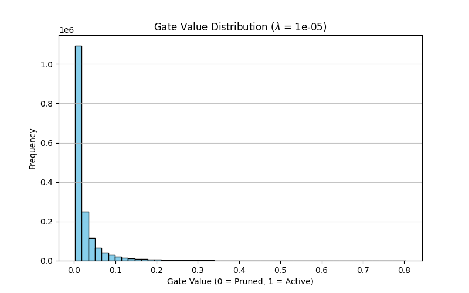

Self-Pruning Neural Network:

This project implements a neural network that dynamically prunes its own weights during training using learnable gating parameters and L1 regularization. The model is evaluated on the CIFAR-10 dataset to study the trade-off between sparsity and accuracy.

Key Idea:
Each weight is associated with a learnable gate (0–1).  
- Gate ≈ 1 → weight active  
- Gate ≈ 0 → weight pruned  
L1 regularization is applied to encourage sparsity.

1. The Sparsity Regularization Mechanism
To encourage the network to dynamically prune its own architecture, an L1 penalty was applied to the sigmoid-activated gate parameters. 

While the standard Cross-Entropy loss optimizes for classification accuracy, it provides no incentive to zero out weights. By adding the L1 norm (the sum of the absolute values of the gates) to the total loss, we apply a constant, linear penalty that pushes the gate values toward zero. Because we use a Sigmoid function, our gates are strictly bounded between (0, 1), meaning the L1 norm simplifies to just the sum of all gate values. 

Unlike an L2 penalty, which exerts less force as values get closer to zero, the L1 penalty maintains a constant pressure. This forces the underlying `gate_scores` into deeply negative territory, effectively flattening the Sigmoid output to exactly 0 and dynamically "pruning" the corresponding weight matrix connection during the forward pass.

2. Experimental Results
The network was trained on CIFAR-10 across four different regularization strengths (lambda) to comprehensively observe the trade-off between model sparsity and test accuracy. The Adam optimizer was used with a learning rate of 0.005 to ensure stable convergence while allowing the penalty enough step size to effectively zero out the gates.

| lambda (Penalty Strength) | Test Accuracy (%) | Sparsity Level (%) |
| **1e-05** | 55.79 | 44.81 |
| **5e-05** | 55.75 | 82.15 |
| **0.0001** | 56.01 | 91.34 |
| **0.0005** | 54.96 | 99.24 |

Observation:
The results demonstrate an effective self-pruning mechanism and clearly illustrate the sparsity-accuracy trade-off. A notable regularization effect was observed: as we increased the penalty strength (lambda), the network not only achieved extreme sparsity (91.34%) but actually reached its peak test accuracy (56.01%). This indicates the L1 penalty successfully pruned redundant, noisy weights, forcing the network to generalize better. However, pushing the penalty further (lambda = 0.0005) forced the network to a breaking point (99.24% sparsity), bottlenecking its capacity and causing the accuracy to finally degrade.

3. How to Run:
* Install dependencies:
   pip install torch torchvision matplotlib
* Run the script:
   python tredence.py
* The script will:
   - Train the model for different lambda values
   - Print accuracy and sparsity
   - Save gate distribution plots
* Gate Distribution Analysis

4. Gate Distribution Analysis:
The distribution shows:
- A large spike at 0 → pruned weights
- Remaining values → important connections

